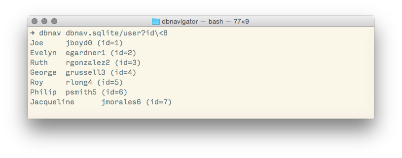

# Database Navigator

Allows you to explore, visualise and export your database. Additionally allows to explore the database using the Powerpack of Alfred 2.0.



- [Main Features](#main-features)
- [Database Navigation](#database-navigation)
	- [Features](#features)
- [Database Visualisation](#database-visualisation)
	- [Features](#features-1)
- [Database Exporter](#database-exporter)
	- [Features](#features-2)
- [Database Executer](#database-executer)
- [Database Differ](#database-differ)
- [Installation](#installation)
	- [Alfred Workflow](#alfred-workflow)
- [Connection Configuration](#connection-configuration)
	- [Sample ~/.pgpass](#sample-pgpass)
- [Content Configuration](#content-configuration)
	- [Usage](#usage)
	- [Title](#title)
	- [Subtitle](#subtitle)
	- [Search](#search)
	- [Display](#display)
	- [Order](#order)
- [Development](#development)

## Main Features
* Database Navigation
* Database Visualisation
* Database Export
* Database Execution
* Database Diff
* Supported databases: PostgreSQL, MySQL, SQLite
* Use database connection definitions from
  * the `~/.pgpass` configuration file (PGAdmin)
  * the `~/.mypass` configuration file (like `~/.pgpass`)
  * the `~/.dbexplorer/dbexplorer.cfg` configuration file (DBExplorer)
  * the Navicat configuration file (SQLite)

## Database Navigation

Documentation: [Navigator](wiki/Navigator)

### Features

* Shows databases of configured connections
* Shows tables of databases
* Shows columns of tables for restricting rows
* Shows rows of tables with multiple restrictions (operators: =, !=, >, <, >=, <=, like, in)
* Shows detailed row information
* Shows info of foreign table row (based on the foreign key)
* Switch to the foreign table row (forward references)
* Shows foreign keys that point to the current table row (back references)
* Configuration of what is shown based on table comments (currently PostgreSQL only)

## Database Visualisation

Visualises the dependencies of a table using its foreign key references (forward and back references).

Documentation: [Grapher](wiki/Grapher)

### Features
* Optionally display columns as well as references
* Highlights primary keys (*) and optional columns (?)
* Optionally include or exclude columns/dependencies from the graph
* Optionally enable recursive inclusion (outputs each table only once, so cycles are not an issue)
* Ouput formats include hierarchical text and a Graphviz directed graph
* Uses the same configuration and URI patterns as the Database Navigator

## Database Exporter

Exports specific rows from the database along with their references rows from other tables.

Documentation: [Exporter](wiki/Exporter)

### Features
* Exports the rows matching the given URI as SQL insert statements
* Allows inclusion of referenced tables (forward and back references)
* Allows exclusion of specific columns (useful if columns are optional, or cyclic references exist)
* Takes into account the ordering of the statements (when table A references table B, then the referenced row from B must be inserted first)
* Limits the number of returned rows of the main query (does not limit referenced rows)

## Database Executer

Executes the SQL statements from the given file on the database specified by the given URI.

Documentation: [Executer](wiki/Executer)

## Database Differ

A diff tool that compares the structure of two database tables with each other.

Documentation: [Differ](wiki/Differ)

## Installation

Installation using PIP is recommended, as it also upgrades to the latest version:

```
pip install --upgrade git+https://github.com/resamsel/dbnavigator.git#egg=dbnav
```

More information and installation options can be found on the [Installation Wiki Page](wiki/Installation).

### Alfred Workflow

To install the Alfred workflow open the [Database Navigator.alfredworkflow](dist/Database Navigator.alfredworkflow?raw=true) file from the dist directory.

## Connection Configuration

To be able to connect to a certain database you’ll need the credentials for that database. Such a connection may be added with PGAdmin (which puts it into the ~/.pgpass file) or added directly into the ~/.pgpass file.

### Sample ~/.pgpass
The ~/.pgpass file contains a connection description per line. The content of that file might look like this:

```
dbhost1:dbport:*:dbuser1:dbpass1
dbhost2:dbport:*:dbuser2:dbpass2
```

## Content Configuration
It's possible to configure the content of the result items for the Database Navigation. The configuration is placed as a table comment (currently PostgreSQL only). This is mostly helpful for displaying results in Alfred, but may come in handy for the command line tools as well.

### Usage
```
{
  "title": "{first_name} {last_name}",
  "subtitle": "{email} ({username})",
  "search": ["email", "username"],
  "display": ["first_name", "last_name", "email", "username", "id"],
  "order": ["first_name", "last_name"]
}
```
### Title
The *title* is the main entry within the Alfred result item. The content will be used as the format within the string.format() method.

### Subtitle
The *subtitle* is the second line within the Alfred result item. See [Title](#title) for details.

### Search
The *search* array contains the columns that will be looked into when no filter column is present in the query string.

This should be used to speed up the query significantly. When no *search* is configured the generated query will look something like this (see example **Show Rows where any (Search) Column matches Pattern**), where *n* is the amount of columns of the table (*n = |table.columns|*):

```
select
		...
	from mytable
	where
		cast(col1 as text) like '%erber%'
		or cast(col2 as text) like '%erber%'
		...
		or cast(coln as text) like '%erber%'
```

When *search* is configured as `["col1", "col7"]` the generated query will look more like this (two filter expressions instead of *n*):

```
select
		...
	from mytable
	where
		cast(col1 as text) like '%erber%'
		or cast(col7 as text) like '%erber%'
```

### Display
The *display* array contains the columns that will be added to the projection list of the SQL query. All items present in the projection list will be shown in the *values* view (see example **Show Values of selected Row**). It will be added as is (no replacements will take place).

### Order
The *order* array will be added to the *order by* part of the SQL query. It will be added as is (no replacements will take place).

## Development
If you want to change anything in the source you can build and install the project by using the make command. You’ll probably need to fiddle around with the ALFRED_WORKFLOW Makefile variable, though.

```
export ALFRED_WORKFLOW=~/Library/Application Support/Alfred 2/Alfred.alfredpreferences/workflows/user.workflow.FE656C03-5F95-4C20-AB50-92A1C286D7CD
make install
```

To simplify development you’d better use `make develop` once and have code changes reflected as soon as you save your file. Super easy development powered by [distutils](https://docs.python.org/2/distutils/index.html).

Using distutils you could easily create a Windows binary (`./setup.py bdist_msi`) or a Red Hat *rpm* package (`./setup.py bdist_rpm`).

